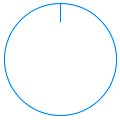

# iOS Knob Control
This is a simple iOS knob control implemented in Swift as a UIControl subclass. It is rotated with a single finger pan and is continuous, meaning you can rotate it 360°.



## Usage

Copy Knob.swift into your project. It implements UIControl's Target-Action interface. When rotated it generates UIControlEvents.ValueChanged. Get the current rotation from the value property, expressed as radians in the clockwise direction (0 to 2 * M_PI). Example:

```
override func viewDidLoad() {
    super.viewDidLoad()
        
    let knob = Knob(frame: CGRect(x: 20, y: 20, width: 100, height: 100))
    self.view.addSubview(knob)
    knob.addTarget(self, action: "knobRotated:", forControlEvents: .ValueChanged)
}

func knobRotated(knob: Knob) {
    print("value: \(knob.value)")
}
```

## License

Knob is available under the MIT license. See the LICENSE file for more info.